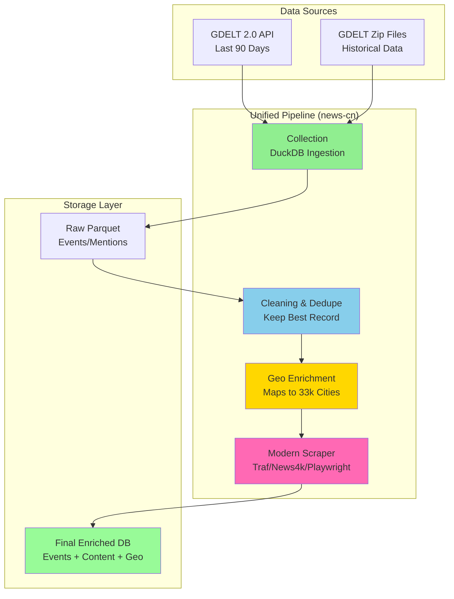

# GDELT Saudi Arabia News Pipeline 🇸🇦

[](https://www.python.org/downloads/)
[](https://duckdb.org/)
[](https://opensource.org/licenses/MIT)

**Efficiently collect and process GDELT news data for Saudi Arabia from 2026 onwards, exported as partitioned Parquet files.**

## 🏗️ Architecture



### 🔄 Data Flow

1. **Recent Data (Quick Win)**: GDELT APIs → JSON (last 90 days, pre-filtered)
2. **Historical Data**: GDELT Files → Stream → DuckDB Filter → Parquet (2026-01-01 onwards)
3. **Result**: Only Saudi Arabia data, ~2.45TB storage saved!

## ✨ Features

- 🆓 **100% FREE** - No API keys or paid services required
- 🚀 **Dual Strategy** - APIs for recent data (quick win!) + streaming downloads for historical data
- 📦 **Efficient Processing** - Streams and filters data without storing massive raw files
- 🔄 **Incremental Processing** - Automatically skips already-processed files on re-runs
- 📊 **Daily Consolidation** - Merges 15-minute files into single daily parquet files
- 💾 **State Management** - Tracks processed files and consolidated days
- 🗂️ **Partitioned Output** - Organized Parquet files by year/month/day
- 🦆 **DuckDB Powered** - Fast, efficient data processing with DuckDB 1.4.4
- 🇸🇦 **Saudi-Focused** - Pre-filtered for Saudi Arabia events and mentions

## 📋 What Gets Collected

The pipeline collects three types of GDELT 2.0 data:

1. **Events** (`export`) - Structured event data (who, what, where, when)
2. **Mentions** - Every mention of each event across global media
3. **GKG** (Global Knowledge Graph) - Themes, emotions, persons, organizations, locations

All data is filtered for Saudi Arabia based on:

- Actor countries (Actor1CountryCode, Actor2CountryCode)
- Geographic locations (ActionGeo_CountryCode, Actor1/2Geo_CountryCode)

## 🎯 Data Collection Strategy

### Method 1: GDELT APIs (Last 90 Days) 🚀

**Quick Win!** For recent data (last 3 months):

- Uses [GDELT DOC API](https://blog.gdeltproject.org/gdelt-doc-2-0-api-debuts/) and [GEO API](https://blog.gdeltproject.org/gdelt-geo-2-0-api-debuts/)
- Pre-filtered by country at source
- JSON format output
- Instant results

### Method 2: Streaming + DuckDB (Historical Data) 📚

For data from 2026-01-01 to 90 days ago:

- Streams GDELT 2.0 files directly from URLs
- Filters with DuckDB during processing
- Only saves Saudi Arabia data
- Partitioned Parquet output

## 🚀 Quick Start

### Installation

```bash
# Clone the repository
cd news-cn

# Install dependencies (using uv)
uv sync
```

> **Why `uv run`?** With `uv`, you don't need to manually activate virtual environments! Just use `uv run command` and it handles everything automatically.

> **📖 New to the pipeline?** See [WORKFLOW.md](WORKFLOW.md) for a complete step-by-step guide!

### Run the Pipeline (That's It!)

```bash
# Single command to get all Saudi Arabia data from 2026 to now
uv run news-cn
```

**What happens automatically:**

- ✅ Collects data from **2026-01-01 to today**
- ✅ Filters for **Saudi Arabia only**
- ✅ **Skips already-processed files** (incremental updates)
- ✅ **Consolidates daily data** (merges 15-min files into daily files)
- ✅ **Cleans up raw data** directory to save disk space
- ✅ Exports clean **Parquet files** organized by date

**Next runs:** Just run `uv run news-cn` again - it automatically continues from where it left off!

### Optional: Advanced Usage

```bash
# Check pipeline status
uv run news-cn-tools stats

# Run diagnostics
uv run news-cn-diagnose

# View example scripts
uv run examples/quick_start_gkg.py
uv run examples/article_enrichment_example.py
```

## 📁 Output Structure

After running `uv run news-cn`, you'll get clean organized data:

```
data/
├── parquet/                      # Clean daily consolidated files
│   └── events/
│       └── year=2026/
│           └── month=01/
│               ├── day=20/
│               │   └── 20260120_consolidated.parquet   # Single daily file
│               ├── day=21/
│               │   └── 20260121_consolidated.parquet
│               └── day=27/                             # Today (partial)
│                   ├── 20260127000000.export.CSV.parquet
│                   └── ...                              # 15-min files (not yet consolidated)
└── .pipeline_state.json          # Tracks processing (don't delete!)
```

### 🔍 Quick Query Examples

```bash
# Count total events
uv run duckdb -c "SELECT COUNT(*) FROM 'data/parquet/events/**/*.parquet';"

# View latest events with article URLs
uv run duckdb -c "SELECT SQLDATE, Actor1Name, Actor2Name, SOURCEURL FROM 'data/parquet/events/**/*.parquet' ORDER BY SQLDATE DESC LIMIT 10;"
```

### 📰 Get Full Article Content

**Important:** GDELT data contains event metadata + article URLs, **not the article text itself**.

To get full article content, use the article scraper:

```bash
# Fetch content for 10 recent articles using Jina AI Reader
uv run news-cn-scrape 10

# Output: data/enriched_articles.json with full article text
```

**What you get:**

- Original GDELT event data (actors, location, tone)
- Full article text (scraped via Jina AI)
- Article metadata (URL, date, content length)

## ⚡ Performance Optimization

### Batch Processing (10x Faster)

For bulk historical data processing, use the optimized batch processor:

```python
from news_cn.batch_processor import BatchGDELTProcessor
from news_cn.downloader import GDELTDownloader
from datetime import datetime

# Setup
downloader = GDELTDownloader()
processor = BatchGDELTProcessor(
    download_workers=10,  # Parallel downloads
    threads=4             # DuckDB parallelism
)

# Get file list
file_list = downloader.get_available_files(
    start_date=datetime(2026, 1, 1),
    data_types=['export']
)

# Process all days (automatically grouped and optimized)
results = processor.process_all_days(file_list, target_country='SA')
```

**Performance Benefits:**

- 🚀 **10x faster** than sequential processing
- 📥 **Parallel downloads** - 10 concurrent workers
- 🔄 **Batch processing** - Single DuckDB query per day
- 💾 **Auto-cleanup** - Temp files deleted automatically
- 📦 **Direct output** - One consolidated parquet per day

**Typical Performance:**

- Sequential: ~5-10 minutes per day
- Batch: ~30-60 seconds per day

See [OPTIMIZATION_SUMMARY.md](OPTIMIZATION_SUMMARY.md) for detailed analysis.

## 🔧 Advanced Usage

### Querying Parquet Files with DuckDB

Create a file `query_example.py`:

```python
import duckdb

# Connect to DuckDB
conn = duckdb.connect()

# Query all Saudi events for January 2026
result = conn.execute("""
    SELECT
        SQLDATE,
        Actor1Name,
        Actor2Name,
        EventCode,
        ActionGeo_FullName,
        AvgTone
    FROM read_parquet('data/parquet/events/year=2026/month=01/**/*.parquet')
    WHERE SQLDATE >= 20260101 AND SQLDATE <= 20260131
    ORDER BY SQLDATE DESC
""").fetchdf()

print(result)
```

Run it:

```bash
uv run query_example.py
```

### Using Only the API (Recent Data)

Create a file `api_example.py`:

```python
from src.news_cn.api_client import GDELTAPIClient

# Initialize client
api = GDELTAPIClient()

# Get last 7 days of Saudi news
articles = api.get_recent_saudi_news(days_back=7)

# Save to JSON
api.save_to_json(articles, 'saudi_news_weekly.json')
```

Run it:

```bash
uv run api_example.py
```

### Using Only Streaming (Historical Data)

Create a file `streaming_example.py`:

```python
from src.news_cn.efficient_processor import EfficientGDELTProcessor
from datetime import datetime

# Initialize processor
processor = EfficientGDELTProcessor()

# Process a specific file
file_url = "http://data.gdeltproject.org/gdeltv2/20260115000000.export.CSV.zip"
result = processor.stream_and_filter_events(file_url, target_country="SA")

print(f"Saved to: {result}")
```

Run it:

```bash
uv run streaming_example.py
```

## 📊 Data Fields

### Events Table (Export)

Key fields include:

- `GLOBALEVENTID` - Unique event identifier
- `SQLDATE` - Date of event (YYYYMMDD)
- `Actor1/2CountryCode` - Countries of actors
- `EventCode` - CAMEO event code
- `GoldsteinScale` - Conflict/cooperation scale (-10 to +10)
- `NumMentions` - Number of mentions
- `AvgTone` - Average tone (-100 to +100)
- `ActionGeo_*` - Geographic coordinates and location names

[Full documentation](http://data.gdeltproject.org/documentation/GDELT-Event_Codebook-V2.0.pdf)

### Mentions Table

- `GLOBALEVENTID` - Links to event
- `MentionTimeDate` - When mentioned
- `MentionSourceName` - Source of mention
- `MentionDocTone` - Tone of the article

### GKG Table

- `Themes` - Extracted themes
- `Locations` - All locations mentioned
- `Persons` - People mentioned
- `Organizations` - Organizations mentioned
- `V2Tone` - Detailed tone metrics

## 🎯 Common Commands

```bash
# Main pipeline (downloads and processes data)
uv run news-cn

# Run diagnostics
uv run news-cn-diagnose

# View pipeline statistics
uv run news-cn-tools stats

# Manually consolidate all pending days
uv run news-cn-tools consolidate

# Reset pipeline state (use with caution!)
uv run news-cn-tools reset

# Clean and normalize data (fix country codes, remove NULLs)
uv run news-cn-clean

# Article scraping (basic - Jina AI)
uv run news-cn-scrape 10

# Article scraping (advanced - nodriver + Firecrawl)
# Article scraping (modern layered approach)
uv run news-cn-scrape 20

# Quick example scripts
uv run examples/quick_start.py
uv run examples/quick_start_gkg.py
uv run examples/complete_pipeline_demo.py
uv run examples/article_enrichment_example.py

# Development commands
uv add package-name           # Install additional packages
uv sync                       # Update dependencies
uv run ruff check --fix src/  # Lint and fix code
uv run ruff format src/       # Format code
uv run pytest                 # Run tests
```

### 📊 Understanding Output

The pipeline creates the following structure:

```
data/
├── .pipeline_state.json      # Tracking file (incremental processing)
├── parquet/
│   └── events/
│       └── year=2026/
│           └── month=01/
│               └── day=20/
│                   ├── 20260120000000.export.CSV.parquet    # 15-min files
│                   ├── 20260120001500.export.CSV.parquet
│                   └── 20260120_consolidated.parquet        # Daily consolidation
└── api/
    └── *.json                # API results
```

**Incremental Processing:**

- First run: Processes all files from START_DATE to today
- Subsequent runs: Only processes new files since last run
- Completed days are automatically consolidated into single daily files

## 💡 Best Practices

1. **Start with APIs** - Get recent data first for quick insights
2. **Batch Historical Downloads** - Process historical data in smaller date ranges
3. **Monitor Storage** - Parquet files are compressed but can add up
4. **Use Partitioning** - Query specific dates using partition filters
5. **Incremental Updates** - Run daily to keep data fresh
6. **Use `uv run`** - No need to manually activate virtual environments!

## 🔍 Research Best Practices (Sources)

Based on research of GDELT processing in 2026:

### BigQuery Approach (Alternative)

- [Partitioned GDELT BigQuery tables](https://blog.gdeltproject.org/announcing-partitioned-gdelt-bigquery-tables/) are 28x cheaper and 4x faster
- Free 1TB/month quota from Google Cloud
- Requires Google Cloud account and authentication

### GDELT APIs

- [DOC API](https://blog.gdeltproject.org/gdelt-doc-2-0-api-debuts/) - Full-text search with country filters
- [GEO API](https://blog.gdeltproject.org/gdelt-geo-2-0-api-debuts/) - Geographic filtering
- Last 3 months of data available
- No authentication required

### DuckDB Processing

- [DuckDB handles 1TB+ datasets efficiently](https://duckdb.org/)
- Streaming execution with disk spill
- Perfect for Parquet and CSV processing
- Supports direct file reading from URLs (including ZIP files)
- Can read remote GDELT files: `SELECT * FROM read_csv('http://data.gdeltproject.org/gdeltv2/file.CSV.zip')`

### Article Content Extraction

- [Jina AI Reader](https://jina.ai/reader) - Free API to convert web pages to clean markdown
- No authentication required
- Usage: `https://r.jina.ai/YOUR_URL` returns article text
- Integrated in pipeline via `news-cn-scrape` command

## 📚 Additional Resources

- [GDELT Project Homepage](https://www.gdeltproject.org/)
- [GDELT 2.0 Documentation](http://data.gdeltproject.org/documentation/GDELT-Event_Codebook-V2.0.pdf)
- [DuckDB Documentation](https://duckdb.org/docs/)
- [GDELT BigQuery Demos](https://blog.gdeltproject.org/a-compilation-of-gdelt-bigquery-demos/)

## 🛠️ Troubleshooting

### "No files found for the specified date range"

- Check that your START_DATE in config.py is correct
- Verify GDELT has data for your date range
- 2026 data availability depends on current date

### Memory Issues

- Reduce `DUCKDB_MEMORY_LIMIT` in config.py
- Process fewer data types at once
- Increase system swap space

### Slow Downloads

- Check your internet connection
- GDELT files are large (100MB-1GB each)
- Consider processing fewer files at a time

## 📄 License

MIT License - see LICENSE file for details

## 🙏 Acknowledgments

- [GDELT Project](https://www.gdeltproject.org/) for providing free, open access to global news data
- [DuckDB](https://duckdb.org/) for the amazing analytical database
- [Google Cloud](https://cloud.google.com/bigquery) for hosting GDELT in BigQuery

## 📞 Support

For issues or questions:

1. Check the troubleshooting section
2. Review GDELT documentation
3. Open an issue on GitHub

---

**Built with ❤️ for research and data analysis**
