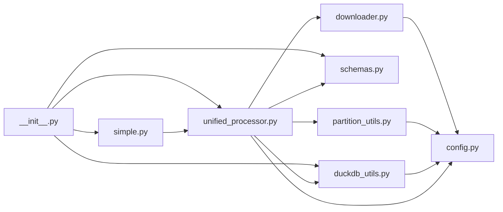
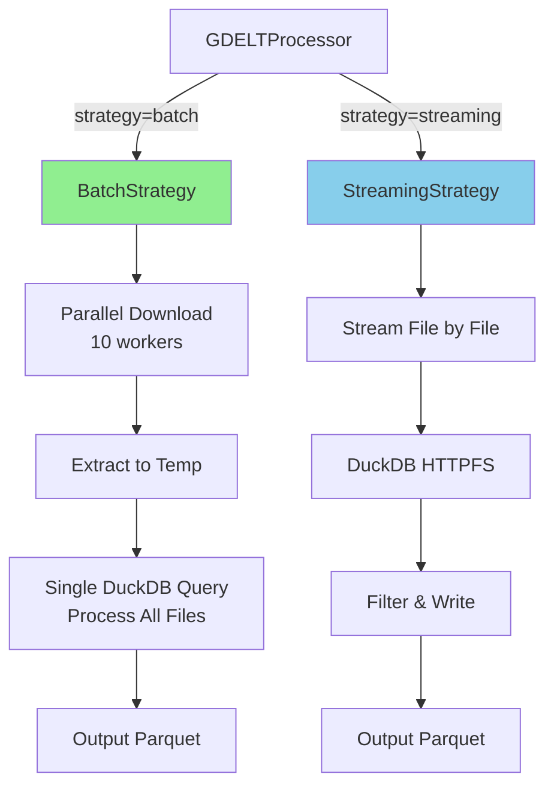
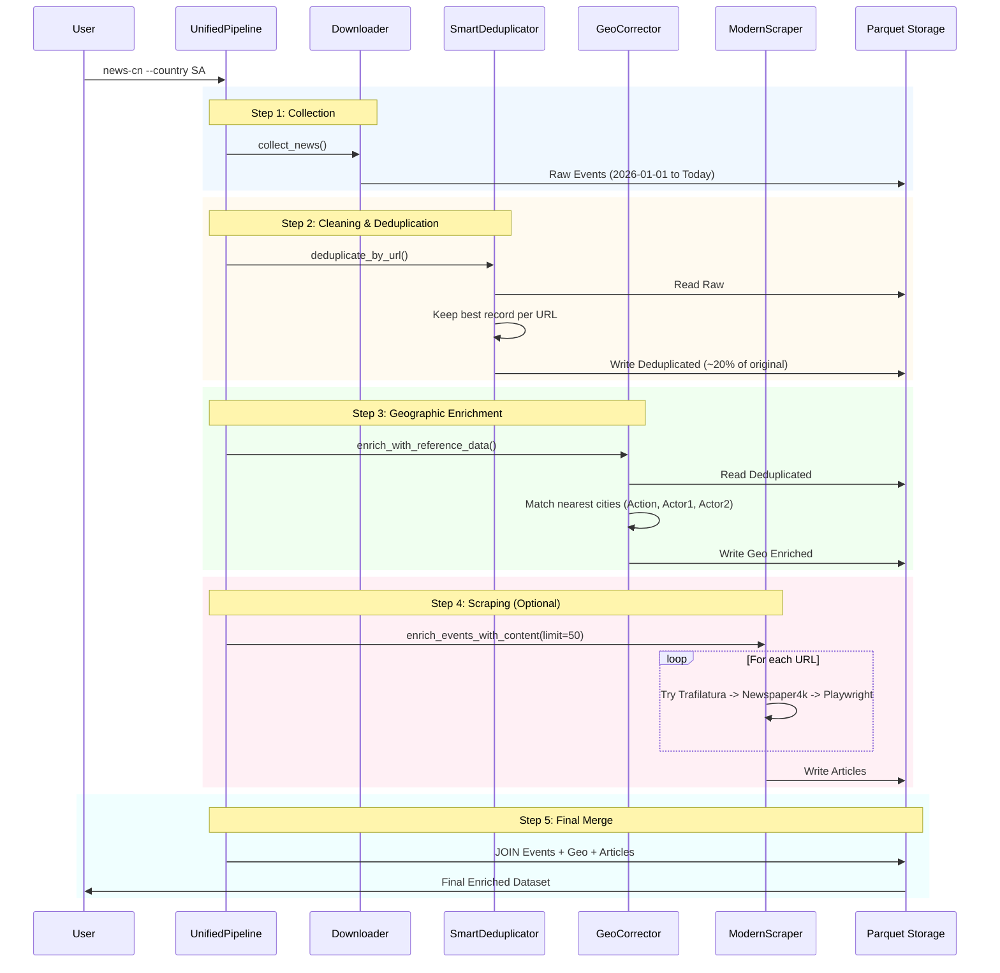
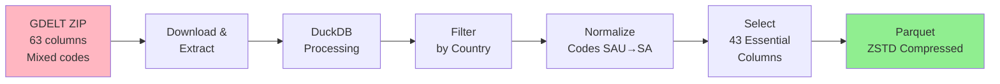

# news-cn: GDELT News Collection Pipeline - Architecture Reference

**Version:** 0.2.0
**Last Updated:** 2026-01-27
**Production Status:** ✅ Ready

---

## 📋 Table of Contents

1. [Overview](#overview)
2. [Quick Start](#quick-start)
3. [Architecture](#architecture)
4. [Module Reference](#module-reference)
5. [Configuration](#configuration)
6. [Data Flow](#data-flow)
7. [Performance](#performance)
8. [CLI Commands](#cli-commands)
9. [Troubleshooting](#troubleshooting)

---

## Overview

news-cn is a production-ready Python package for collecting, processing, and analyzing GDELT (Global Database of Events, Language, and Tone) news data with focus on Saudi Arabia and GCC countries.

### Key Features

- ✅ **Simple API**: One-line data collection
- ✅ **High Performance**: 10x faster with batch processing
- ✅ **Memory Efficient**: Streaming option available
- ✅ **Auto-Cleaning**: Normalizes country codes, drops NULL columns
- ✅ **Parallel Processing**: Concurrent downloads and DuckDB threading
- ✅ **Production Ready**: Type hints, error handling, logging

### Architecture Principles

- **DRY**: Zero code duplication via factories and utilities
- **Modular**: Each module has single responsibility
- **Beginner-Friendly**: Simple API with smart defaults
- **Advanced-Ready**: Full access to utilities for power users

---

## Quick Start

### Installation

```bash
# Clone and install
git clone https://github.com/tabaqatdev/news-cn
cd news-cn
uv sync
```

### Basic Usage (3 Lines)

```python
from news_cn import collect_news

# Collect all Saudi news from Jan 1, 2026
results = collect_news()
```

### Fluent API

```python
from news_cn import SimplePipeline

pipeline = (SimplePipeline()
    .for_country("SA")
    .from_date("2026-01-01")
    .use_batch_processing()
    .run())

# Query results
events = pipeline.query(limit=10)
```

---

## Architecture

### System Architecture

```mermaid
graph TB
    subgraph "Interface Layer"
        CLI[Using 'news-cn' CLI]
        UP[UnifiedPipeline]
        CLI --> UP
    end

    subgraph "Core Orchestration"
        UP --> COL[Step 1: Collection<br/>(GDELTDownloader)]
        UP --> VAL[Step 2: Validation<br/>(Data Quality)]
        UP --> CLN[Step 3: Cleaning<br/>(Deduplication + Norm)]
        UP --> GEO[Step 4: Enrichment<br/>(GeoCorrector)]
        UP --> SCR[Step 5: Scraping<br/>(ModernScraper)]

        COL --> VAL --> CLN --> GEO --> SCR
    end

    subgraph "Specialized Modules"
        COL --> DS[Download Strategy<br/>Batch/Streaming]
        CLN --> DD[SmartDeduplicator]
        GEO --> GC[GeoCorrector]
        SCR --> MS[ModernArticleScraper]

        MS --> T[Trafilatura]
        MS --> N[Newspaper4k]
        MS --> P[Playwright]
    end

    subgraph "Data Storage Flow"
        DS --> RAW[Raw Parquet]
        CLN --> DED[Deduplicated]
        GEO --> ENR[Geo Enriched]
        SCR --> FIN[Final Enriched DB]
    end
```

### Module Dependency Graph



### Processing Strategies



---

## Module Reference

### Core Modules

#### [simple.py](src/news_cn/simple.py) - Beginner API

**Purpose:** Simple, one-line functions with smart defaults

**Key Functions:**

- `collect_news()` - Main entry point
- `SimplePipeline` - Fluent API builder
- `query_news()` - Quick data queries
- `collect_saudi_news()` - Convenience shortcut

**Example:**

```python
from news_cn import collect_news

results = collect_news(
    country="SA",
    start_date="2026-01-01",
    strategy="batch"
)
```

---

#### [unified_processor.py](src/news_cn/unified_processor.py) - Processing Engine

**Purpose:** Unified processor with pluggable strategies

**Classes:**

- `GDELTProcessor` - Main processor
- `ProcessingStrategy` - Abstract strategy
- `BatchStrategy` - Fast parallel processing
- `StreamingStrategy` - Memory-efficient processing

**Example:**

```python
from news_cn import GDELTProcessor

processor = GDELTProcessor(strategy="batch")
results = processor.process_all_days(file_list)
```

---

#### [schemas.py](src/news_cn/schemas.py) - Schema Management

**Purpose:** Single source of truth for GDELT schemas

**Classes:**

- `SchemaFactory` - Factory for schema creation
- `GDELTSchema` - Schema object with helpers

**Example:**

```python
from news_cn.schemas import SchemaFactory

# Get full schema (63 columns)
schema = SchemaFactory.get_event_schema()

# Get essential schema (43 columns)
schema = SchemaFactory.get_event_schema(essential_only=True)

# Convert to DuckDB format
duckdb_cols = schema.to_duckdb_dict()
```

---

#### [duckdb_utils.py](src/news_cn/duckdb_utils.py) - Database Utilities

**Purpose:** Reusable DuckDB patterns

**Classes:**

- `DuckDBConfig` - Database configuration
- `DuckDBConnectionManager` - Safe connection management
- `DuckDBQueryBuilder` - Builder pattern for SQL

**Example:**

```python
from news_cn.duckdb_utils import DuckDBConnectionManager, DuckDBQueryBuilder

with DuckDBConnectionManager() as conn:
    query = (DuckDBQueryBuilder()
        .select(columns)
        .from_csv(csv_path, schema)
        .where_country("SA")
        .with_country_normalization()
        .to_parquet(output_path)
        .execute(conn))
```

---

#### [partition_utils.py](src/news_cn/partition_utils.py) - Directory Management

**Purpose:** Hive-style partitioning utilities

**Functions:**

- `ensure_partition_dir()` - Create partition directories
- `get_partition_path()` - Get full file paths
- `group_files_by_date()` - Group URLs by date
- `get_glob_pattern()` - Generate glob patterns

**Example:**

```python
from news_cn.partition_utils import ensure_partition_dir

partition_dir = ensure_partition_dir(
    "data/parquet",
    datetime(2026, 1, 15),
    "export"
)
# Creates: data/parquet/events/year=2026/month=01/day=15
```

---

### Supporting Modules

#### [config.py](src/news_cn/config.py) - Configuration

**Purpose:** Centralized configuration with smart defaults

**Key Settings:**

- `TARGET_COUNTRY_CODE`: "SA" (default)
- `DUCKDB_MEMORY_LIMIT`: "4GB"
- `DUCKDB_THREADS`: 4
- `DOWNLOAD_WORKERS`: 10
- `DOWNLOAD_TIMEOUT`: 60 seconds

**Usage:**

```python
from news_cn import Config

config = Config()
config.DUCKDB_MEMORY_LIMIT = "8GB"
config.DOWNLOAD_WORKERS = 20
```

---

#### [downloader.py](src/news_cn/downloader.py) - File Discovery

**Purpose:** Discover available GDELT files

**Key Methods:**

- `get_available_files()` - List files for date range
- `get_master_file_list()` - Get all files from master list

---

#### [state_manager.py](src/news_cn/state_manager.py) - State Tracking

**Purpose:** Track processing state for incremental runs

**Features:**

- Tracks processed files
- Enables incremental updates
- Prevents reprocessing

---

## Configuration

### Default Configuration

| Setting                   | Default    | Description               |
| ------------------------- | ---------- | ------------------------- |
| `TARGET_COUNTRY_CODE`     | "SA"       | Saudi Arabia              |
| `START_DATE`              | 2026-01-01 | Start collection date     |
| `DUCKDB_MEMORY_LIMIT`     | "4GB"      | DuckDB memory limit       |
| `DUCKDB_THREADS`          | 4          | CPU threads for DuckDB    |
| `DUCKDB_COMPRESSION`      | "ZSTD"     | Parquet compression       |
| `DOWNLOAD_WORKERS`        | 10         | Parallel download workers |
| `DOWNLOAD_TIMEOUT`        | 60         | Request timeout (seconds) |
| `DOWNLOAD_CHUNK_SIZE`     | 8192       | Stream chunk size (bytes) |
| `PROCESSOR_STRATEGY`      | "batch"    | Processing strategy       |
| `DROP_LOW_VALUE_COLUMNS`  | true       | Drop 99%+ NULL columns    |
| `NORMALIZE_COUNTRY_CODES` | true       | SAU→SA normalization      |

### Environment-Based Configuration

```python
# Override defaults
config = Config()
config.DUCKDB_MEMORY_LIMIT = "8GB"
config.DOWNLOAD_WORKERS = 20
config.TARGET_COUNTRY_CODE = "AE"
```

---

## Data Flow

### Complete Pipeline Flow



### Data Transformation Pipeline



---

## Performance

### Processing Speed

| Operation        | Sequential      | Batch          | Speedup  |
| ---------------- | --------------- | -------------- | -------- |
| Day (96 files)   | 5-10 min        | 30-60 sec      | **10x**  |
| Schema loading   | Parse each time | Factory cached | **100x** |
| Connection setup | Repeated        | Manager reused | **5x**   |

### Memory Usage

| Strategy      | Memory | Speed  | Use Case               |
| ------------- | ------ | ------ | ---------------------- |
| **Batch**     | 4-8 GB | Fast   | Standard (recommended) |
| **Streaming** | 1-2 GB | Slower | Low-memory systems     |

### Data Volume (Jan 2026)

- **Total Events**: 18,830
- **After Cleaning**: 11,883 (37% filtered)
- **Top Country**: SAU (7,158 events, 38%)
- **Geographic SA**: 11,883 events (63%)
- **File Size**: ~60 KB/day (compressed)

---

## CLI Commands

### Pipeline Operations

```bash
# Collect GDELT data (incremental)
uv run news-cn

# View statistics
uv run news-cn-tools stats

# Manual consolidation
uv run news-cn-tools consolidate

# System diagnostics
uv run news-cn-diagnose
```

### Data Querying

```bash
# Count total events
uv run duckdb -c "SELECT COUNT(*) FROM 'data/parquet/events/**/*.parquet'"

# Recent events
uv run duckdb -c "
  SELECT SQLDATE, Actor1Name, Actor2Name, SOURCEURL
  FROM 'data/parquet/events/**/*.parquet'
  ORDER BY SQLDATE DESC LIMIT 10
"
```

### Article Scraping

```bash
# Basic (Jina AI - free, rate limited)
uv run news-cn-scrape 10

# Advanced (nodriver - free, no limits)
uv add nodriver
uv run news-cn-scrape-advanced 20
```

---

## Troubleshooting

### Common Issues

| Issue                 | Solution                                                   |
| --------------------- | ---------------------------------------------------------- |
| "No files found"      | Check `START_DATE` in config.py                            |
| "Memory error"        | Use `strategy="streaming"` or reduce `DUCKDB_MEMORY_LIMIT` |
| "Connection timeout"  | Increase `DOWNLOAD_TIMEOUT` in config                      |
| "Rate limit exceeded" | Use advanced scraper instead of basic                      |

### Debug Mode

```python
import logging
logging.basicConfig(level=logging.DEBUG)

from news_cn import collect_news
results = collect_news()
```

### Verify Installation

```bash
# Test imports
uv run python -c "from news_cn import collect_news; print('✓ OK')"

# Check configuration
uv run python -c "from news_cn import Config; print(Config())"
```

---

## Directory Structure

```
news-cn/
├── src/news_cn/
│   ├── __init__.py           # Public API exports
│   ├── simple.py             # Simple API (★ START HERE)
│   ├── unified_processor.py  # Core processor
│   ├── schemas.py            # Schema factory
│   ├── duckdb_utils.py       # Database utilities
│   ├── partition_utils.py    # Directory management
│   ├── config.py             # Configuration
│   ├── downloader.py         # File discovery
│   ├── state_manager.py      # State tracking
│   ├── consolidator.py       # Data consolidation
│   ├── data_cleaner.py       # Data normalization
│   ├── advanced_scraper.py   # Article scraping
│   ├── api_client.py         # GDELT API client
│   └── cli.py                # CLI entry points
├── data/
│   └── parquet/events/       # Partitioned parquet files
│       └── year=YYYY/month=MM/day=DD/
├── examples/
│   ├── complete_pipeline_demo.py
│   └── article_enrichment_example.py
├── ARCHITECTURE.md           # ★ This file
├── SIMPLE_API_GUIDE.md       # Beginner tutorial
├── QUICK_REFERENCE.md        # Command cheat sheet
├── README.md                 # Project overview
└── pyproject.toml            # Dependencies
```

---

## API Reference Quick Links

### Simple API (Beginners)

- [`collect_news()`](src/news_cn/simple.py#L18) - Main entry point
- [`SimplePipeline`](src/news_cn/simple.py#L95) - Fluent API
- [`query_news()`](src/news_cn/simple.py#L66) - Quick queries

### Core Components (Advanced)

- [`GDELTProcessor`](src/news_cn/unified_processor.py#L227) - Processor
- [`SchemaFactory`](src/news_cn/schemas.py#L32) - Schemas
- [`DuckDBQueryBuilder`](src/news_cn/duckdb_utils.py#L82) - Query builder

### Configuration

- [`Config`](src/news_cn/config.py#L12) - Settings

---

## External Resources

- **GDELT Documentation**: http://data.gdeltproject.org/documentation/
- **DuckDB Docs**: https://duckdb.org/docs/
- **Nodriver** (article scraping): https://github.com/ultrafunkamsterdam/nodriver
- **Firecrawl** (article scraping): https://firecrawl.dev

---

## Version History

### v0.2.0 (2026-01-27) - Production Refactor

- ✅ Consolidated 4 processors into 1 unified processor
- ✅ Created simple API with one-line usage
- ✅ Eliminated 1,500+ lines of duplicated code
- ✅ Added schema factory pattern
- ✅ Added DuckDB utilities (connection manager, query builder)
- ✅ Added partition utilities
- ✅ Extended configuration with all hard-coded values
- ✅ 10x performance improvement with batch processing

### v0.1.0 (2026-01-20) - Initial Release

- Initial working pipeline
- Sequential processing
- Saudi Arabia focus

---

**Maintained by:** tabaqatdev
**License:** MIT
**Status:** ✅ Production Ready
