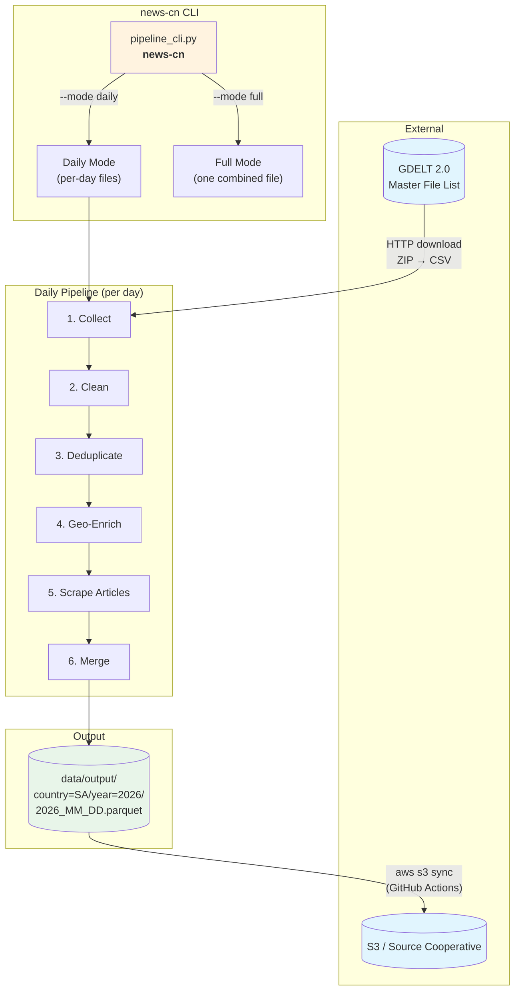
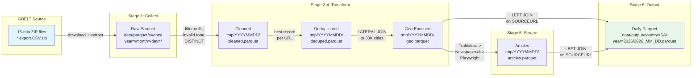
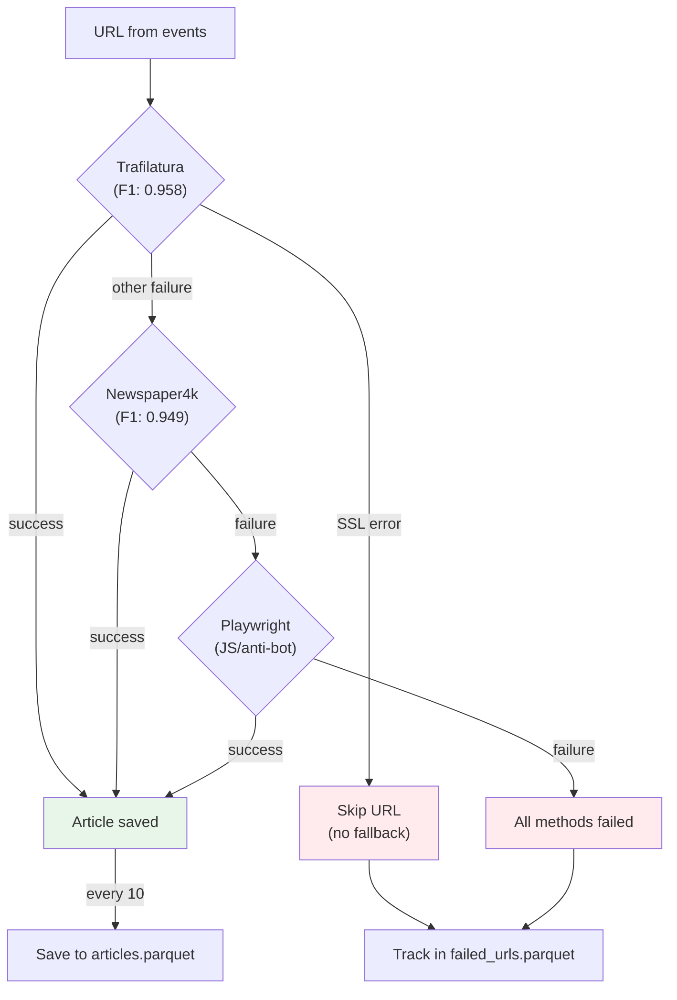
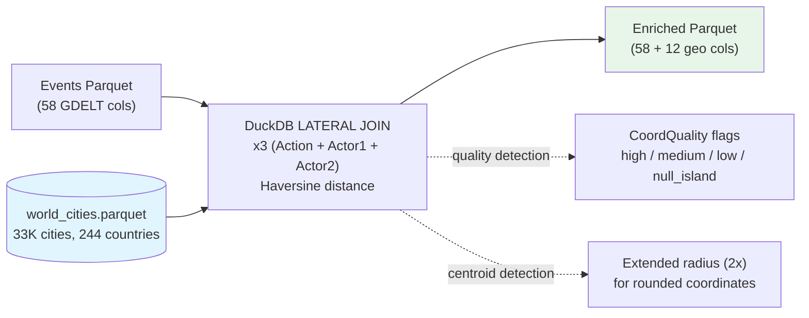

# GDELT News Pipeline - Technical Guide

Version 0.3.0

## System Architecture



## Data Flow (Daily Mode)



## Article Scraping Flow



## Geo-Enrichment Flow



---

## Pipeline Stages (Input / Output)

### Stage 1: Collect

| | |
|---|---|
| **Module** | `downloader.py` + `simple.py` + `unified_processor.py` |
| **Input** | GDELT master file list (HTTP) → `*.export.CSV.zip` files |
| **Process** | Download ZIPs for date range, extract CSVs, filter by country code, write to Hive-partitioned parquet |
| **Output** | `data/parquet/events/year={YYYY}/month={MM}/day={DD}/*.parquet` |
| **Columns** | 58 standard GDELT 2.0 Event fields |

### Stage 2: Clean

| | |
|---|---|
| **Module** | Inline SQL in `pipeline_cli.py:_process_single_day()` |
| **Input** | Raw day parquet from Stage 1 |
| **Process** | `SELECT DISTINCT *` with filters: `GLOBALEVENTID IS NOT NULL`, `SQLDATE IS NOT NULL`, `SOURCEURL IS NOT NULL AND != ''`, `AvgTone BETWEEN -10 AND 10` |
| **Output** | `data/tmp/{YYYYMMDD}/cleaned.parquet` (ZSTD compressed) |
| **Effect** | Removes nulls, empty URLs, out-of-range tone values, exact duplicate rows |

### Stage 3: Deduplicate

| | |
|---|---|
| **Module** | `deduplicator.py` → `SmartDeduplicator.deduplicate_by_url()` |
| **Input** | `cleaned.parquet` from Stage 2 |
| **Process** | Scores each record by data completeness (actor names, geo fields, dates), keeps highest-scoring record per unique `SOURCEURL` |
| **Output** | `data/tmp/{YYYYMMDD}/deduped.parquet` |
| **Effect** | Multiple events sharing the same article URL are collapsed to the best one |

### Stage 4: Geo-Enrich

| | |
|---|---|
| **Module** | `geo_corrector.py` → `GeoCorrector.enrich_with_reference_data()` |
| **Input** | `deduped.parquet` from Stage 3 + `data_helpers/world_cities.parquet` |
| **Process** | Three DuckDB LATERAL JOINs (ActionGeo, Actor1Geo, Actor2Geo), each finding nearest city by Haversine distance within max 500 km (1000 km for detected country centroids). Adds coordinate quality flags. Filters out events missing Actor1 or Actor2 coordinates. |
| **Output** | `data/tmp/{YYYYMMDD}/geo.parquet` — original 58 cols + 12 new geo cols |
| **Columns added** | `NearestCity`, `CityPopulation`, `DistanceToCity_km`, `CoordQuality` (x3 for Action/Actor1/Actor2) |
| **Effect** | Record count may decrease (events without both actor coordinates are dropped) |

### Stage 5: Scrape Articles

| | |
|---|---|
| **Module** | `modern_scraper.py` → `ModernArticleScraper.enrich_events_with_content()` |
| **Input** | `geo.parquet` from Stage 4 (reads unique `SOURCEURL` values) |
| **Process** | For each URL (up to `--scrape-limit`): try Trafilatura → Newspaper4k → Playwright. SSL errors skip all fallbacks. Progress saved every 10 attempts. |
| **Output** | `data/tmp/{YYYYMMDD}/articles.parquet` — one row per successfully scraped URL |
| **Columns** | `url`, `title`, `content`, `author`, `publish_date`, `content_length`, `scrape_method` |
| **Side effects** | Failed URLs tracked for resume capability |

### Stage 6: Merge + Write

| | |
|---|---|
| **Module** | `modern_scraper.py` → `merge_articles_with_events()` + inline SQL fallback |
| **Input** | `geo.parquet` (events) + `articles.parquet` (scraped articles) |
| **Process** | `LEFT JOIN` on `SOURCEURL = url` using `DISTINCT ON (url)` to prevent row multiplication. If no articles were scraped, adds NULL article columns directly. |
| **Output** | `data/output/country={CC}/year={YYYY}/{YYYY_MM_DD}.parquet` (ZSTD compressed) |
| **Columns** | 58 GDELT + 12 geo + 6 article = **76 columns** |
| **Cleanup** | Temp directory `data/tmp/{YYYYMMDD}/` deleted after successful write |

---

### Source Modules

| Module | Entry Point | Purpose |
|--------|-------------|---------|
| `pipeline_cli.py` | `news-cn` | Main orchestrator (daily + full modes) |
| `downloader.py` | - | Downloads GDELT 2.0 ZIP files from master file list |
| `simple.py` | - | `collect_news()` API, fluent `SimplePipeline` |
| `unified_processor.py` | - | Processes raw CSVs into partitioned parquet |
| `data_cleaner.py` | `news-cn-clean` | Validates, filters, removes invalid records |
| `deduplicator.py` | - | Best-record-per-URL selection using quality scoring |
| `geo_corrector.py` | `news-cn-geo` | City matching with LATERAL JOIN + Haversine |
| `modern_scraper.py` | `news-cn-scrape` | Layered article extraction with resume |

### Output Structure

```
data/output/
  country=SA/
    year=2026/
      2026_01_01.parquet
      2026_01_02.parquet
      ...
```

Each file: 58 GDELT event columns + 12 geo columns + 6 article columns = 76 total.

---

## Geographic Enrichment

### How It Works

`GeoCorrector.enrich_with_reference_data()` enriches all three GDELT coordinate sets using DuckDB LATERAL JOINs with Haversine distance:

- **ActionGeo** (where the event occurred) -> `NearestCity`, `CityPopulation`, `DistanceToCity_km`, `CoordQuality`
- **Actor1Geo** (where actor 1 is located) -> `Actor1_NearestCity`, `Actor1_CityPopulation`, `Actor1_DistanceToCity_km`, `Actor1_CoordQuality`
- **Actor2Geo** (where actor 2 is located) -> `Actor2_NearestCity`, `Actor2_CityPopulation`, `Actor2_DistanceToCity_km`, `Actor2_CoordQuality`

### Reference Database

Default: `data_helpers/world_cities.parquet` (33K+ cities, 244 countries). Falls back to a built-in 50-city database if the file is missing.

Custom databases are supported — any parquet with columns: `city`, `country`, `country_code`, `lat`, `lon`, `population`.

### Coordinate Quality Flags

GDELT uses country centroids (~40% of coordinates) when exact location is unknown. These are rounded coordinates that often land in deserts or oceans. The pipeline detects and flags them:

| Quality | Detection | Meaning |
|---------|-----------|---------|
| `high` | 2+ decimal precision | Precise geolocation |
| `medium` | 1 decimal precision | City-level |
| `low` | Whole numbers or .5 | Country centroid (likely) |
| `null_island` | Near (0, 0) | Missing data |

Country centroids get an extended matching radius (2x `max_distance_km`) so they still match to the nearest real city. For example, Oman's centroid at (21.0, 57.0) is in the Arabian Sea but matches Muscat at 333 km.

### FIPS vs ISO Country Codes

GDELT geo fields (`ActionGeo_CountryCode`, `Actor1Geo_CountryCode`) use **FIPS 10-4** codes, while actor fields (`Actor1CountryCode`) use **ISO 3166**. Common differences:

| Country | FIPS (Geo fields) | ISO (Actor fields) |
|---------|-------------------|-------------------|
| Yemen | YM | YE |
| Russia | RS | RU |
| Saudi Arabia | SA | SA |

This is standard GDELT behavior, not a bug.

### Filtering by Quality

```sql
-- Only precise coordinates
SELECT * FROM 'data/output/country=SA/**/*.parquet'
WHERE CoordQuality IN ('high', 'medium');

-- Precise OR centroids near cities
SELECT * FROM 'data/output/country=SA/**/*.parquet'
WHERE CoordQuality IN ('high', 'medium')
   OR DistanceToCity_km <= 100;
```

---

## Article Scraping

### Layered Fallback Strategy

1. **Trafilatura** — fastest, F1: 0.958, no JS support
2. **Newspaper4k** — fast fallback, news-optimized
3. **Playwright** — handles JS-rendered pages and anti-bot

If Trafilatura succeeds, the other methods are skipped. SSL errors cause immediate fast-fail (no fallback to other methods).

### Fast-Fail on Errors

The scraper uses a custom `requests.Session` with zero retries and a 5-second timeout, bypassing urllib3's retry logic. This turns 30-second SSL failures into 1-second skips.

Fast-fail error types: SSL/TLS errors, HTTP 403/404, timeouts, connection resets.

### Resume Capability

Progress is saved every 10 attempts to two files:
- **Successful scrapes** -> articles parquet (appended with `DISTINCT ON (url)`)
- **Failed URLs** -> `failed_urls.parquet`

On resume, both successful and failed URLs are skipped. Run the same command again to continue from where you stopped.

### Merge Strategy

Daily mode uses **LEFT JOIN** — all events appear in the output, with NULL article columns for events that weren't scraped. This preserves the complete event dataset.

Full mode (legacy) uses **INNER JOIN** by default — only events with articles appear.

---

## Output Schema

### GDELT Event Fields (58 columns)

Standard [GDELT 2.0 Event fields](http://data.gdeltproject.org/documentation/GDELT-Event_Codebook-V2.0.pdf). Key fields:

`GLOBALEVENTID`, `SQLDATE`, `Actor1Name`, `Actor2Name`, `EventCode`, `GoldsteinScale`, `AvgTone`, `ActionGeo_FullName`, `ActionGeo_CountryCode`, `SOURCEURL`

### Geographic Enrichment (12 columns)

| Column | Type | Geo Field |
|--------|------|-----------|
| `NearestCity` | VARCHAR | ActionGeo |
| `CityPopulation` | INTEGER | ActionGeo |
| `DistanceToCity_km` | DOUBLE | ActionGeo |
| `CoordQuality` | VARCHAR | ActionGeo |
| `Actor1_NearestCity` | VARCHAR | Actor1Geo |
| `Actor1_CityPopulation` | INTEGER | Actor1Geo |
| `Actor1_DistanceToCity_km` | DOUBLE | Actor1Geo |
| `Actor1_CoordQuality` | VARCHAR | Actor1Geo |
| `Actor2_NearestCity` | VARCHAR | Actor2Geo |
| `Actor2_CityPopulation` | INTEGER | Actor2Geo |
| `Actor2_DistanceToCity_km` | DOUBLE | Actor2Geo |
| `Actor2_CoordQuality` | VARCHAR | Actor2Geo |

### Article Fields (6 columns)

| Column | Type | Description |
|--------|------|-------------|
| `ArticleTitle` | VARCHAR | Scraped article title |
| `ArticleContent` | VARCHAR | Full article text |
| `ArticleAuthor` | VARCHAR | Author (NULL if not found) |
| `ArticlePublishDate` | VARCHAR | Publication date (NULL if not found) |
| `ArticleContentLength` | BIGINT | Content length in characters |
| `ArticleScrapeMethod` | VARCHAR | `trafilatura`, `newspaper4k`, or `playwright` |

Events without scraped articles have NULL in all article columns.

---

## CLI Reference

### Main Pipeline

```bash
news-cn [options]

--mode daily|full        Pipeline mode (default: daily)
--country CODE           Country code (default: SA)
--start-date YYYY-MM-DD  Start date (default: 2026-01-01)
--end-date YYYY-MM-DD    End date (default: yesterday in daily mode)
--output-dir DIR         Output directory (default: data)
--scrape-limit N         Max articles per day (default: 500)
--strategy batch|streaming  Processing strategy (default: batch)
--no-scrape              Skip article scraping (full mode only)
--no-geo                 Disable geo-enrichment (full mode only)
--no-dedupe              Disable deduplication (full mode only)
```

### Standalone Tools

```bash
news-cn-scrape [limit]          # Scrape articles from existing parquet
news-cn-clean                    # Clean and validate event data
news-cn-geo --action validate    # Check coordinate validity
news-cn-geo --action enrich      # Enrich with city data
news-cn-geo --action correct     # Correct coordinates to nearest city
news-cn-diagnose                 # Run diagnostics
```

### Geo-Corrector Options

```bash
news-cn-geo --action enrich \
  --input "data/parquet/events/**/*.parquet" \
  --output "data/parquet/geo_enriched" \
  --reference-db "data_helpers/world_cities.parquet" \
  --max-distance 500 \
  --country SA
```

---

## Query Examples

```sql
-- Count events for a day
duckdb -c "SELECT count(*) FROM 'data/output/country=SA/year=2026/2026_02_07.parquet'"

-- Events with articles
duckdb -c "
  SELECT SQLDATE, Actor1Name, ArticleTitle, SOURCEURL
  FROM 'data/output/country=SA/**/*.parquet'
  WHERE ArticleTitle IS NOT NULL
  ORDER BY SQLDATE DESC
  LIMIT 10
"

-- Scrape method distribution
duckdb -c "
  SELECT ArticleScrapeMethod, count(*) as n
  FROM 'data/output/country=SA/**/*.parquet'
  WHERE ArticleScrapeMethod IS NOT NULL
  GROUP BY 1
"

-- City-level event counts
duckdb -c "
  SELECT NearestCity, count(*) as events, round(avg(DistanceToCity_km), 1) as avg_km
  FROM 'data/output/country=SA/**/*.parquet'
  WHERE NearestCity IS NOT NULL
  GROUP BY 1 ORDER BY 2 DESC LIMIT 15
"

-- Coordinate quality distribution
duckdb -c "
  SELECT CoordQuality, count(*) as n
  FROM 'data/output/country=SA/**/*.parquet'
  WHERE CoordQuality IS NOT NULL
  GROUP BY 1 ORDER BY 2 DESC
"

-- Cross-day totals
duckdb -c "
  SELECT count(*) as total, count(ArticleTitle) as with_articles
  FROM 'data/output/country=SA/**/*.parquet'
"
```

---

## Python API

```python
from news_cn import collect_news, query_news, SimplePipeline

# One-liner
results = collect_news(country="SA", start_date="2026-02-01")

# Fluent API
pipeline = (SimplePipeline()
    .for_country("SA")
    .from_date("2026-01-01")
    .to_date("2026-01-31")
    .use_batch_processing()
    .run())

events = pipeline.query(limit=20)

# Query existing data
events = query_news(country="SA", limit=10)
```

---

## Development

```bash
uv sync                            # Install dependencies
uv run playwright install chromium --with-deps
uv run ruff check src/             # Lint
uv run ruff format src/            # Format
uv run pytest                      # Test
```

---

## GitHub Actions

The workflow at `.github/workflows/daily-pipeline.yml` runs the pipeline daily at midnight UTC and uploads to S3.

### Required Configuration

**Secrets:** `AWS_ACCESS_KEY_ID`, `AWS_SECRET_ACCESS_KEY`, `AWS_DEFAULT_REGION`

**Variables:** `S3_BUCKET` (e.g. `us-west-2.opendata.source.coop`), `S3_PREFIX` (e.g. `tabaqat/gdelt-sa`)

### Trigger Patterns

- **Daily cron**: processes yesterday automatically
- **Backfill**: manual trigger with `start_date=2026-01-01`
- **Single day**: manual trigger with both dates set to the same value
